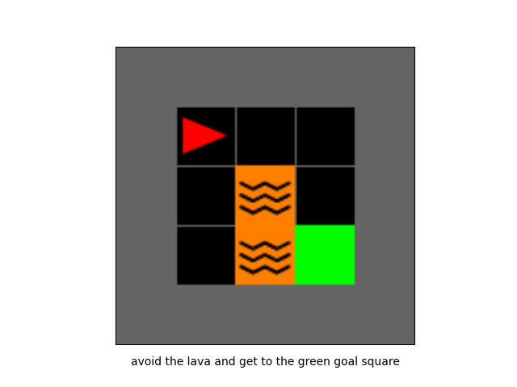
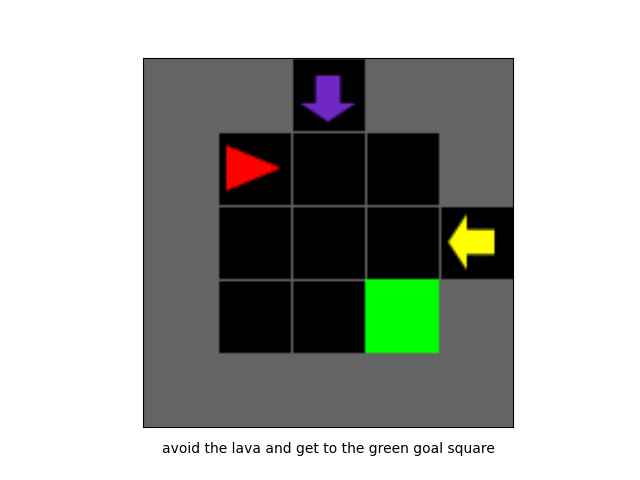
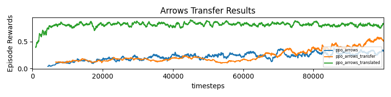

# symbol-grounding
An empirical demonstration of a discontinuous performance increase via learned symbol grounding

An RL agent is trained (via PPO) to avoid lava obstacles and reach a goal. 
The agent is then transferred to a new environment, where the location of lava obstacles
are indicated by colored arrows. A supervised translator is trained to predict lava locations from arrow environmental 
observations. Performance is compared amoung the frozen pretrained agent with accessed to the translator, the pretrained
agent trained on the new environment, and a randomly initialized agent learning the new environment from scratch.




### Results


# Installation

### Dependencies

```angular2html
pip3 install -r requirements.txt
```

### Gym Minigrid
```angular2html
cd gym-minigrid
pip3 install -e .
```

# Usage

### Replicate Paper
To replicate the experiment from the paper, run 
```angular2html
python main.py
```

### Modify training durations
To experiment with different training durations, use the `--pretrain_steps`
and `--tranfer_steps` arguments:
```angular2html
python main.py --pretrain_steps 1000000 --transfer_steps 300000
```

### Train individual components
To train models individually (and analyze the results) use the following scripts:
<l>
- `train_lava.py`
- `train_arrows.py`
- `transfer_arrows.py`
- `arrow_to_lava/train_translator.py`
- `translate_arrow_lava.py`
- `plot_results.py`
</l>


