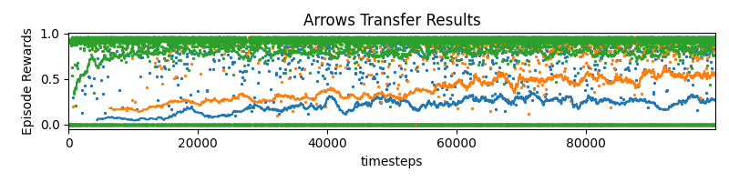

# symbol-grounding
An empirical demonstration of a discontinuous performance increase via learned symbol grounding

### Results


# Installation

### Dependencies

```angular2html
pip3 install -r requirements.txt
```

### Gym Minigrid
```angular2html
cd gym-minigrid
pip3 install -e .
```

# Usage

### Replicate Paper
To replicate the experiment from the paper, run 
```angular2html
python main.py
```

### Modify training durations
To experiment with different training durations, use the `--pretrain_steps`
and `--tranfer_steps` arguments:
```angular2html
python main.py --pretrain_steps 1000000 --transfer_steps 300000
```

### Train individual components
To train models individually (and analyze the results) use the following scripts:
<l>
- `train_lava.py`
- `train_arrows.py`
- `transfer_arrows.py`
- `arrow_to_lava/train_translator.py`
- `translate_arrow_lava.py`
- `plot_results.py`
</l>


